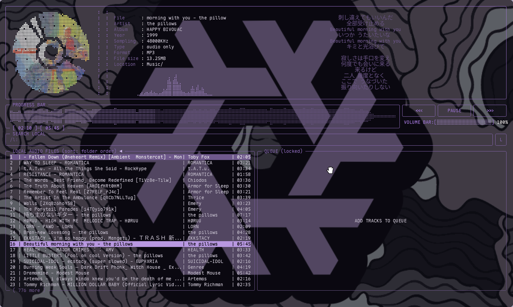
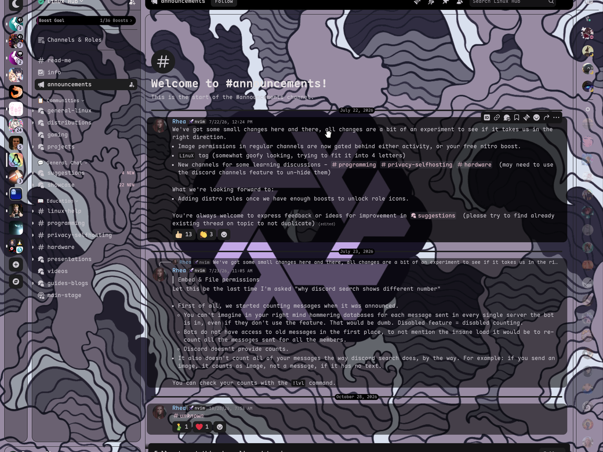

# nix-config

## My NixOS with Umbriel WM.

### Music

<table>
  <tr>
    <td width="50%"></td>
    <td width="50%"></td>
  </tr>
</table>

### Wallpapers

<table>
  <tr>
    Wallpaper selectors
  
  
    Download new wallpapers
  
  </tr>
</table>

### Apps

<table>
  <tr>
    <td width="50%"></td>
    <td width="50%"></td>
  </tr>
</table>
Uncreative, I know. I'll work on it EVENTUUUAAAALLLLYYYYYYYYYYY!

Hardware-specific pieces: (RTX 4090, 3440x1440 at 240 Hz, disk UUIDs) need changing for another machine.
